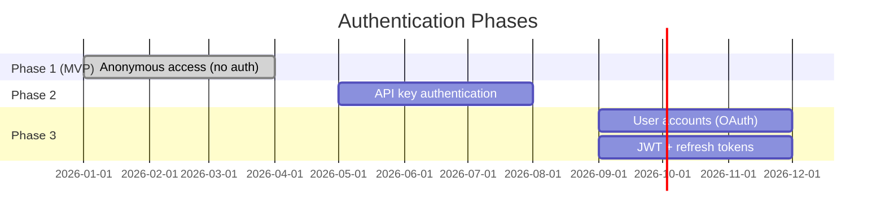
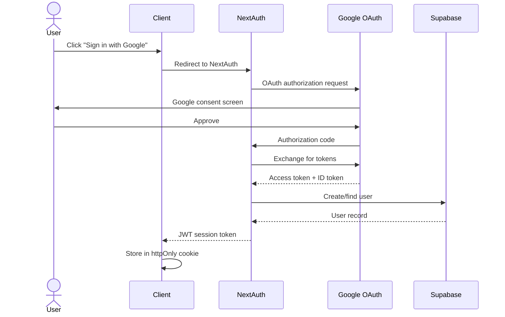

# MemeGPT — API Authentication

> **Document Version:** 2.0 · **Last Updated:** 2026-08-02

---

## Purpose

Complete authentication strategy for MemeGPT's API — anonymous access (Phase 1), API key authentication (Phase 2), and OAuth/JWT (Phase 3).

---

## Authentication Roadmap



---

## Phase 1: Anonymous Access (Current)

**No authentication required.** All endpoints are public. Rate limiting by IP address is the only access control.

```python
# No auth middleware needed — just rate limiting
@router.post("/search")
async def search(request: SearchRequest):
    # Anyone can call this
    return await recommend_memes(request.query)
```

**Why:** Zero friction for users. A meme finder shouldn't require login. Maximum adoption.

---

## Phase 2: API Key Authentication

```python
# app/core/auth.py
from fastapi import Header, HTTPException
import hashlib

async def verify_api_key(
    x_api_key: str | None = Header(None, alias="X-API-Key")
) -> dict:
    if not x_api_key:
        return {"tier": "anonymous", "rate_limit": 60}
    
    key_hash = hashlib.sha256(x_api_key.encode()).hexdigest()
    key_record = await db.api_keys.find_unique(
        where={"key_hash": key_hash}
    )
    
    if not key_record or key_record.revoked:
        raise HTTPException(401, "Invalid or revoked API key")
    
    return {
        "tier": key_record.tier,
        "rate_limit": key_record.rate_limit,
        "user_id": key_record.user_id,
    }
```

### API Key Format

```
mgpt_live_a1b2c3d4e5f6g7h8i9j0k1l2m3n4o5p6
│     │    │
│     │    └── 32-char random hex
│     └── environment (live/test)
└── prefix (always "mgpt")
```

---

## Phase 3: User Authentication (OAuth + JWT)



---

## Best Practices

1. **Hash API keys before storing** — SHA-256, never store raw keys
2. **Use httpOnly cookies for JWTs** — prevents XSS theft
3. **Short-lived access tokens** — 15-minute expiry
4. **Long-lived refresh tokens** — 7-day expiry, stored securely
5. **Rate limit by tier** — anonymous < free developer < pro

---

> **Related Documents:**
> - [03_Backend/Authorization.md](../03_Backend/Authorization.md) — RBAC and permissions
> - [11_Security/API_Security.md](../11_Security/API_Security.md) — Security overview
