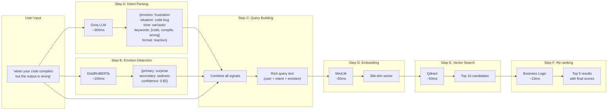

# MemeGPT — Smart Meme Search (Feature Deep Dive)

> **Document Version:** 2.0 · **Last Updated:** 2026-08-02

---

## Purpose

Complete feature specification for MemeGPT's core feature — AI-powered meme search. Covers how it differs from traditional search, the internal pipeline, user flow, quality metrics, and implementation details.

---

## Background

Smart Meme Search is MemeGPT's **killer feature** — the single capability that justifies the product's existence. While Google, Giphy, and Know Your Meme rely on keyword matching and tag-based retrieval, MemeGPT understands the **meaning, emotion, and context** behind what users type.

---

## How It Differs From Traditional Search

| Aspect | Traditional (Giphy, Google) | MemeGPT Smart Search |
|---|---|---|
| **Input** | Keywords ("sad dog meme") | Natural language ("when you hear your ex is doing well") |
| **Understanding** | Exact keyword match | Semantic meaning + emotion + context |
| **Ranking** | Tag frequency + popularity | AI-scored: similarity + emotion match + popularity |
| **Formats** | Usually one format | All formats available per meme |
| **Emotion** | None | Detected and matched (7 emotions) |
| **Speed** | ~500ms | ~560ms (comparable, with 10× smarter results) |
| **Improvement** | Manual tag curation | Auto-improves from user feedback weekly |

---

## How It Works (Internal Pipeline)



---

## Feature Requirements

| Requirement | Priority | Status | Details |
|---|---|---|---|
| Accept free-form text input (up to 2000 chars) | P0 | ✅ | Pydantic validation, any language |
| AI parses intent (emotion, situation, tone) | P0 | ✅ | Groq Llama 3.1 8B |
| Local emotion detection (7 emotions) | P0 | ✅ | DistilRoBERTa, ~100ms |
| Returns 5 ranked meme results | P0 | ✅ | Re-ranked by composite score |
| Show relevance score per result | P1 | ✅ | 0–100% displayed as badge |
| Show emotion match labels | P1 | ✅ | Emoji + emotion name |
| Multiple format options per meme | P1 | ✅ | GIF, PNG, MP4, WebP |
| Copy to clipboard (one click) | P1 | ✅ | Clipboard API |
| Download with format selection | P1 | ✅ | CDN redirect |
| Support multi-line conversation paste | P1 | ☐ | Paste WhatsApp/Discord chat |
| Suggestion chips ("Monday vibe", "Win") | P1 | ✅ | Pre-defined quick searches |
| Multi-turn chat refinement | P2 | ☐ | "Something more sarcastic" follow-up |
| Voice input (mobile) | P2 | ☐ | Speech-to-text → search |
| Image-based search (reverse search) | P3 | ☐ | Upload image → find similar memes |

---

## User Flow (Step-by-Step)

```
1. User opens MemeGPT (web or mobile)
2. Sees search input with placeholder: "What's happening? 🤔"
3. Sees suggestion chips: [Monday vibe] [Frustration] [Win] [Programmer life]
4. Types: "when your code compiles but the output is wrong"
5. Presses Ctrl+Enter (desktop) or taps Search (mobile)
6. Loading skeleton appears with animated gradient border (~1.2s)
7. 5 meme results appear in a responsive grid:
   - Each card shows: thumbnail, name, "94% match", emotion tags (😤 😮)
   - Format badges: [GIF] [PNG] [MP4] (active = purple, unavailable = grey)
   - Action buttons: [📋 Copy] [⬇ Download] [📤 Share]
8. User hovers over "This Is Fine" meme card:
   - Card lifts (translateY -4px)
   - Shadow deepens with purple glow
9. User clicks "📋 Copy" button:
   - Button shows spinner (200ms)
   - Toast appears: "✓ Copied to clipboard!"
   - Feedback event: POST /api/v1/feedback {action: "copy"}
10. User pastes meme in WhatsApp → sends to group chat
11. (Optional) User clicks 👍 on the meme result
    - Feedback event: POST /api/v1/feedback {action: "thumbs_up"}
```

---

## Search Quality Targets

### Offline Metrics (evaluated on labeled test set)

| Metric | Formula | Target | Current |
|---|---|---|---|
| **Precision@3** | Relevant memes in top-3 ÷ 3 | >70% | TBD |
| **Precision@5** | Relevant memes in top-5 ÷ 5 | >70% | TBD |
| **Recall@10** | Relevant in top-10 ÷ all relevant | >85% | TBD |
| **NDCG@5** | Normalized Discounted Cumulative Gain | >75% | TBD |
| **MRR** | Mean Reciprocal Rank of first relevant | >80% | TBD |

### Online Metrics (production monitoring)

| Metric | Target | Measurement |
|---|---|---|
| **Perceived relevance** | >75% positive | In-app 👍/👎 ratio |
| **Click-Through Rate** | >30% | Clicks ÷ Impressions |
| **Download Rate** | >15% | Downloads ÷ Clicks |
| **Copy Rate** | >20% | Copies ÷ Clicks |
| **Zero-result rate** | <5% | Queries with all scores <0.3 |
| **Response time (P50)** | <1.0s | Server-side timing |
| **Response time (P95)** | <3.0s | Server-side timing |
| **Cache hit rate** | >50% | Redis hits ÷ total requests |

---

## Scoring Formula (Composite Score)

```python
final_score = (
    cosine_similarity          # Base: 0.0–1.0 (from Qdrant)
    + (0.15 if primary_emotion_match)     # Emotion boost
    + (0.08 if secondary_emotion_match)   # Secondary emotion
    + (popularity_score * 0.10)           # Popularity: 0–10%
    + (0.05 if format_preference_match)   # Format convenience
)
# Capped at 1.0, displayed as percentage (e.g., 94%)
```

---

## Example Searches

| User Input | Parsed Intent | Emotion | Top Result | Score |
|---|---|---|---|---|
| "when the code finally works" | joy, programming success | surprise + joy | "Success Kid" | 0.92 |
| "Monday morning feeling" | frustration, work start | sadness + anger | "Kermit sipping tea" | 0.89 |
| "my flight got cancelled" | anger, travel disaster | anger + sadness | "Disaster Girl" | 0.87 |
| "just got promoted!" | joy, career achievement | joy + surprise | "Leonardo Cheers" | 0.94 |
| "3am coding session" | exhaustion, late work | sadness + neutral | "This Is Fine" | 0.85 |

---

## Edge Cases

| Input Type | Example | Handling |
|---|---|---|
| Emoji only | "😂😂😂" | Valid — MiniLM generates embedding, low-quality results |
| Very short | "sad" | Valid — returns sad memes, limited context |
| Very long (2000 chars) | Full WhatsApp conversation | Valid — LLM extracts key themes, MiniLM truncates to 512 tokens |
| Non-English | "lunes por la mañana" | Partial support — MiniLM is English-focused, may return related English memes |
| Offensive | Slurs, hate speech | NSFW filter + content moderation (Phase 2) |
| Gibberish | "asdfghjkl" | Returns low-confidence results, may suggest "try something else" |

---

## Future Improvements

1. **Multi-turn refinement** — "Something more sarcastic" after initial results
2. **Voice input** — Speech-to-text → search (mobile only)
3. **Image-based search** — Upload a screenshot → find the original meme
4. **Conversation paste** — Paste a full chat log → get memes for the context
5. **Personalization** — Rank higher memes the user has liked before
6. **Real-time suggestions** — Show meme previews as the user types (typeahead)

---

> **Related Documents:**
> - [Multi_Format.md](./Multi_Format.md) — Format selection feature
> - [Chat_Refinement.md](./Chat_Refinement.md) — Multi-turn search
> - [05_AI_System/AI_Pipeline.md](../05_AI_System/AI_Pipeline.md) — Pipeline implementation
> - [07_APIs/Search_API.md](../07_APIs/Search_API.md) — Search endpoint spec
