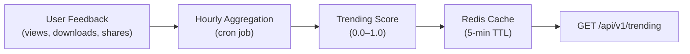

# MemeGPT — Trending System

> **Document Version:** 2.0 · **Last Updated:** 2026-08-02

---

## Purpose

Complete specification of the trending meme system — scoring algorithm, hourly refresh, category-based trending, and API endpoint.

---

## How Trending Works



---

## Trending Score Formula

```python
def calculate_trending_score(meme_id: str) -> float:
    """Measures engagement velocity in the last 24 hours."""
    f = get_feedback_last_24_hours(meme_id)
    raw = (
        f.get("views", 0)     * 0.1 +
        f.get("clicks", 0)    * 0.5 +
        f.get("downloads", 0) * 2.0 +
        f.get("shares", 0)    * 3.0 +
        f.get("thumbs_up", 0) * 2.0
    )
    return min(1.0, raw / 1000)
```

| Score Range | Label | Display |
|---|---|---|
| 0.80–1.00 | 🔥 Hot | Top of trending |
| 0.50–0.79 | 📈 Rising | Mid-trending |
| 0.20–0.49 | ➡️ Steady | Lower trending |
| <0.20 | Not shown | Below threshold |

---

## Category-Based Trending

| Category | Example Memes | Update Frequency |
|---|---|---|
| All | Combined top 50 | Hourly |
| Work | Office memes, Monday memes | Hourly |
| Gaming | Gamer rage, victory memes | Hourly |
| Relationships | Couple memes, breakup memes | Hourly |
| Tech/Programming | Code memes, bug memes | Hourly |
| Sports | Celebration, defeat memes | Hourly |

---

## Hourly Refresh Cron

```yaml
# .github/workflows/trending.yml
name: Refresh Trending
on:
  schedule:
    - cron: '0 * * * *'  # Every hour
jobs:
  refresh:
    runs-on: ubuntu-latest
    steps:
      - run: python scripts/refresh_trending.py
```

```python
# scripts/refresh_trending.py
def refresh_trending():
    categories = ["all", "work", "gaming", "relationships", "tech", "sports"]
    for category in categories:
        memes = get_memes_by_category(category)
        scored = [(m, calculate_trending_score(m.id)) for m in memes]
        scored.sort(key=lambda x: x[1], reverse=True)
        top_50 = scored[:50]
        cache.setex(f"trending:{category}", 3600, json.dumps(top_50))
    print(f"Trending refreshed for {len(categories)} categories")
```

---

## Best Practices

1. **Cache trending results** — 5-minute TTL to reduce DB load
2. **Recalculate hourly** — daily is too slow, per-request is too expensive
3. **Use 24-hour window** — captures daily trends without seasonal bias
4. **Weight shares heavily** — sharing = strongest signal of virality
5. **Show trending score visually** — 🔥 icon for top memes

---

> **Related Documents:**
> - [05_AI_System/Scoring_Logic.md](../05_AI_System/Scoring_Logic.md) — Scoring details
> - [07_APIs/Meme_API.md](../07_APIs/Meme_API.md) — Trending API endpoint
