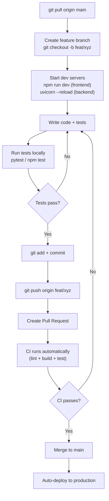

# MemeGPT — Development Workflow

> **Document Version:** 2.0 · **Last Updated:** 2026-08-02

---

## Purpose

Complete daily development workflow — from pulling code to pushing changes, including local testing, linting, and pre-commit checks.

---

## Daily Workflow



---

## Local Development Commands

```bash
# Terminal 1: Backend
cd services/api
pip install -r requirements.txt
uvicorn app.main:app --reload --port 8000

# Terminal 2: Frontend
cd apps/web
npm install
npm run dev  # → http://localhost:5173

# Terminal 3: Local services (optional)
docker-compose up -d  # Redis + Qdrant
```

---

## Branch Strategy

| Branch | Purpose | Deploys To |
|---|---|---|
| `main` | Production-ready | Auto-deploy to prod |
| `feat/*` | New features | PR → main |
| `fix/*` | Bug fixes | PR → main |
| `docs/*` | Documentation | PR → main |

---

## Commit Convention

```
feat: add suggestion chips to search
fix: handle empty query validation
docs: update API Architecture docs
perf: cache trending results for 5 minutes
test: add emotion detection unit tests
chore: update dependencies
```

---

## Pre-Commit Checklist

- [ ] Code compiles without errors
- [ ] Tests pass locally (`pytest` / `npm test`)
- [ ] No hardcoded API keys or secrets
- [ ] Linter passes (ruff for Python, ESLint for TypeScript)
- [ ] New features have tests
- [ ] Documentation updated (if API changed)

---

> **Related Documents:**
> - [Git_Workflow.md](./Git_Workflow.md) — Branch and merge strategy
> - [Coding_Standards.md](./Coding_Standards.md) — Style guidelines
> - [Code_Review.md](./Code_Review.md) — Review process
