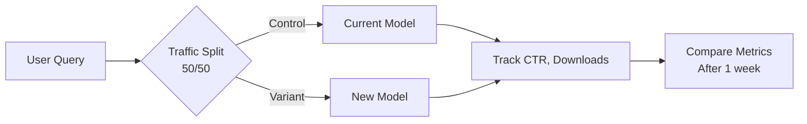

# MemeGPT — AI Evaluation

> **Document Version:** 1.0 · **Last Updated:** 2026-08-02

---

## Purpose

Evaluation framework for measuring and improving MemeGPT's search quality and AI model performance.

---

## Evaluation Metrics

| Metric | Formula | Target | Measured |
|---|---|---|---|
| **Precision@5** | (Relevant in top 5) ÷ 5 | >70% | Weekly offline |
| **Recall@10** | (Relevant in top 10) ÷ (all relevant) | >85% | Weekly offline |
| **MRR** | Mean(1/rank_of_first_relevant) | >80% | Weekly offline |
| **NDCG@5** | Normalized Discounted Cumulative Gain | >75% | Weekly offline |
| **CTR** | Clicks ÷ Impressions | >30% | Daily online |
| **Download Rate** | Downloads ÷ Clicks | >15% | Daily online |
| **Thumbs Up Rate** | Thumbs up ÷ (Thumbs up + down) | >80% | Daily online |

---

## Offline Evaluation

### Test Dataset

A curated set of 100 query-meme pairs with human-annotated relevance:

```python
TEST_CASES = [
    {
        "query": "when code works on first try",
        "relevant_memes": ["surprised-pikachu", "confused-math-lady"],
        "irrelevant_memes": ["sad-keanu", "grumpy-cat"]
    },
    {
        "query": "Monday morning feeling",
        "relevant_memes": ["grumpy-cat", "monday-meme", "this-is-fine"],
        "irrelevant_memes": ["success-kid", "doge"]
    },
    # ... 98 more test cases
]
```

### Evaluation Script

```python
# evaluate.py
from backend.app.meme_matcher import match_memes

def evaluate_search():
    total_precision = 0
    total_mrr = 0
    
    for test in TEST_CASES:
        results = match_memes(test["query"], limit=5)
        result_ids = [r["id"] for r in results]
        
        # Precision@5
        relevant_in_top5 = len(set(result_ids) & set(test["relevant_memes"]))
        precision = relevant_in_top5 / 5
        total_precision += precision
        
        # MRR
        for i, rid in enumerate(result_ids):
            if rid in test["relevant_memes"]:
                total_mrr += 1 / (i + 1)
                break
    
    avg_precision = total_precision / len(TEST_CASES)
    avg_mrr = total_mrr / len(TEST_CASES)
    
    print(f"P@5: {avg_precision:.2%} | MRR: {avg_mrr:.2%}")
```

---

## Online Evaluation (A/B Testing)



### A/B Test Decision Criteria

| Metric | Minimum Improvement | Sample Size |
|---|---|---|
| CTR | +5% | 1,000 queries |
| Download Rate | +3% | 1,000 queries |
| P@5 (offline) | +2% | 100 test cases |
| Latency | No regression | 1,000 queries |

---

## Failure Analysis

When search quality degrades, investigate:

1. **Check embedding model** — did sentence-transformers update break anything?
2. **Check Qdrant index** — is the index corrupted or outdated?
3. **Check Groq response quality** — is the LLM returning valid JSON?
4. **Check new memes** — did recent indexing add low-quality memes?
5. **Check score distribution** — are scores unusually low or high?

---

> **Related Documents:**
> - [Testing_Strategy.md](./Testing_Strategy.md) · [05_AI_System/AI_Overview.md](../05_AI_System/AI_Overview.md) · [05_AI_System/Future_AI.md](../05_AI_System/Future_AI.md)
