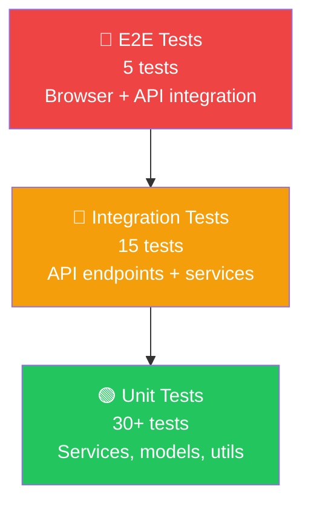

# MemeGPT — Testing Strategy (Complete Guide)

> **Document Version:** 2.0 · **Last Updated:** 2026-08-02

---

## Purpose

Complete testing strategy — unit tests, integration tests, performance tests, load tests, and ML evaluation metrics. Includes full test code from the engineering specification.

---

## Testing Pyramid



| Layer | Count | Speed | Coverage |
|---|---|---|---|
| Unit tests | 30+ | <1s each | Services, models, utilities |
| Integration tests | 15 | <3s each | API endpoints, full pipeline |
| Performance tests | 5 | <10s each | Latency, throughput |
| Load tests (Locust) | 1 suite | 5min run | Concurrent users |
| ML evaluation | 1 suite | 30min | Search quality metrics |

---

## Unit Tests

### Recommendation Service Tests

```python
# tests/test_recommendation.py
import pytest
from app.services.recommendation import recommend_memes

TEST_CASES = [
    ("I just got promoted", "joy", ["achievement", "success"]),
    ("My flight got cancelled", "frustration", ["travel", "disappointment"]),
    ("It's finally Friday", "joy", ["weekend", "relief"]),
    ("My code worked on first try", "surprise", ["programming", "success"]),
    ("Mondays be like", "frustration", ["monday", "work"]),
]

@pytest.mark.asyncio
async def test_recommendation_returns_results():
    """Every valid query must return at least 1 result."""
    for query, expected_emotion, expected_tags in TEST_CASES:
        results = await recommend_memes(query, format_pref="any")
        assert len(results) >= 1, f"No results for: {query}"
        top_score = results[0]["score"]
        assert top_score > 0.5, f"Low confidence for: {query} (score: {top_score})"

@pytest.mark.asyncio
async def test_nsfw_filter():
    """NSFW content must be excluded when nsfw=False."""
    results = await recommend_memes("anything", nsfw=False)
    for r in results:
        assert r["meme"]["nsfw"] == False

@pytest.mark.asyncio
async def test_gif_format_filter():
    """When format=gif, all results must have GIF available."""
    results = await recommend_memes("happy", format_pref="gif")
    for r in results:
        assert r["meme"]["has_gif"] == True

@pytest.mark.asyncio
async def test_result_limit():
    """Results must not exceed the specified limit."""
    results = await recommend_memes("test", format_pref="any")
    assert len(results) <= 5

@pytest.mark.asyncio
async def test_scores_are_sorted():
    """Results must be sorted by score (highest first)."""
    results = await recommend_memes("monday morning", format_pref="any")
    scores = [r["score"] for r in results]
    assert scores == sorted(scores, reverse=True)
```

### Emotion Detection Tests

```python
# tests/test_emotion.py
from app.services.embedding import detect_emotion

def test_joy_detection():
    result = detect_emotion("I just won the lottery!")
    assert result["primary"] == "joy"
    assert result["confidence"] > 0.7

def test_sadness_detection():
    result = detect_emotion("My pet passed away yesterday")
    assert result["primary"] == "sadness"

def test_anger_detection():
    result = detect_emotion("This is absolutely unacceptable!")
    assert result["primary"] == "anger"

def test_neutral_detection():
    result = detect_emotion("The weather is 72 degrees today")
    assert result["primary"] == "neutral"

def test_confidence_range():
    result = detect_emotion("anything")
    assert 0.0 <= result["confidence"] <= 1.0
```

---

## Integration Tests

### API Endpoint Tests

```python
# tests/test_api.py
import pytest
from httpx import AsyncClient
from app.main import app

@pytest.mark.asyncio
async def test_search_endpoint_success():
    async with AsyncClient(app=app, base_url="http://test") as client:
        response = await client.post("/api/v1/search", json={
            "query": "Monday morning feeling",
            "format_preference": "gif",
            "limit": 5
        })
    assert response.status_code == 200
    data = response.json()
    assert data["success"] == True
    assert len(data["results"]) <= 5
    assert "query_id" in data
    assert "intent_parsed" in data

@pytest.mark.asyncio
async def test_search_empty_query_returns_422():
    async with AsyncClient(app=app, base_url="http://test") as client:
        response = await client.post("/api/v1/search", json={
            "query": "",
            "format_preference": "gif"
        })
    assert response.status_code == 422

@pytest.mark.asyncio
async def test_search_too_long_query():
    async with AsyncClient(app=app, base_url="http://test") as client:
        response = await client.post("/api/v1/search", json={
            "query": "x" * 2001,
        })
    assert response.status_code == 422

@pytest.mark.asyncio
async def test_meme_detail_endpoint():
    async with AsyncClient(app=app, base_url="http://test") as client:
        response = await client.get("/api/v1/memes/this-is-fine")
    assert response.status_code in [200, 404]

@pytest.mark.asyncio
async def test_health_check():
    async with AsyncClient(app=app, base_url="http://test") as client:
        response = await client.get("/health")
    assert response.status_code == 200
    assert response.json()["status"] == "ok"

@pytest.mark.asyncio
async def test_feedback_endpoint():
    async with AsyncClient(app=app, base_url="http://test") as client:
        response = await client.post("/api/v1/feedback", json={
            "query_id": "q_test",
            "meme_id": "meme_test",
            "action": "download"
        })
    assert response.status_code == 200
    assert response.json()["recorded"] == True
```

---

## Performance Tests

```python
# tests/test_performance.py
import time, asyncio

@pytest.mark.asyncio
async def test_latency_under_3_seconds():
    """Search must complete within 3 seconds (P95)."""
    start = time.time()
    await recommend_memes("test query for performance")
    elapsed = time.time() - start
    assert elapsed < 3.0, f"Too slow: {elapsed:.2f}s"

@pytest.mark.asyncio
async def test_cache_hit_is_fast():
    """Cached responses must return in under 200ms."""
    query = "cached query test"
    await recommend_memes(query)       # First call (no cache)
    
    start = time.time()
    await recommend_memes(query)       # Second call (cache hit)
    elapsed = time.time() - start
    assert elapsed < 0.2, f"Cache miss: {elapsed:.2f}s"

@pytest.mark.asyncio
async def test_concurrent_requests():
    """10 concurrent searches should all complete within 5 seconds."""
    queries = [f"test query {i}" for i in range(10)]
    start = time.time()
    results = await asyncio.gather(
        *[recommend_memes(q) for q in queries]
    )
    elapsed = time.time() - start
    assert elapsed < 5.0, f"Concurrent too slow: {elapsed:.2f}s"
    assert all(len(r) > 0 for r in results)
```

---

## Load Tests (Locust)

```python
# locustfile.py
from locust import HttpUser, task, between

class MemeGPTUser(HttpUser):
    wait_time = between(1, 3)
    
    @task(10)
    def search_meme(self):
        self.client.post("/api/v1/search", json={
            "query": "Monday morning feeling",
            "format_preference": "gif"
        })
    
    @task(3)
    def get_trending(self):
        self.client.get("/api/v1/trending")
    
    @task(1)
    def get_meme_detail(self):
        self.client.get("/api/v1/memes/this-is-fine")

# Run: locust -f locustfile.py --host https://api.memegpt.com
# Target: 100 concurrent users, <3s P95
```

---

## ML Evaluation Metrics

```bash
# Run weekly evaluation against labeled test set
python scripts/evaluate.py \
  --test-file data/eval/test_queries.json \
  --k 3 5 10 \
  --output reports/eval_$(date +%Y%m%d).json
```

| Metric | Formula | Target |
|---|---|---|
| **Precision@3** | Relevant in top-3 ÷ 3 | >0.70 |
| **Recall@10** | Relevant in top-10 ÷ all relevant | >0.85 |
| **NDCG@5** | Normalized Discounted Cumulative Gain | >0.75 |
| **MRR** | Mean Reciprocal Rank of first relevant | >0.80 |

---

## CI/CD Integration

```yaml
# .github/workflows/test.yml
name: Tests
on: [push, pull_request]

jobs:
  test:
    runs-on: ubuntu-latest
    steps:
      - uses: actions/checkout@v4
      - uses: actions/setup-python@v5
        with:
          python-version: "3.11"
      - run: pip install -r services/api/requirements.txt
      - run: pip install pytest pytest-asyncio httpx
      - run: pytest services/api/tests/ -v --tb=short
        env:
          GROQ_API_KEY: ${{ secrets.GROQ_API_KEY }}
          QDRANT_URL: ${{ secrets.QDRANT_URL }}
          QDRANT_API_KEY: ${{ secrets.QDRANT_API_KEY }}
```

---

## Best Practices

1. **Test the happy path AND edge cases** — empty queries, max-length input, emoji-only
2. **Mock external services** for unit tests — don't call Groq/Qdrant in CI
3. **Use real services** for integration tests — verify actual behavior
4. **Run performance tests** against staging, not production
5. **Track ML metrics weekly** — catch quality regressions before users notice
6. **Use `pytest-asyncio`** for async tests — MemeGPT is fully async

---

> **Related Documents:**
> - [Unit_Tests.md](./Unit_Tests.md) — Detailed unit test catalog
> - [Integration_Tests.md](./Integration_Tests.md) — Integration test details
> - [Performance_Tests.md](./Performance_Tests.md) — Performance benchmarks
> - [12_Deployment/CI_CD_Pipeline.md](../12_Deployment/CI_CD_Pipeline.md) — CI/CD workflow
