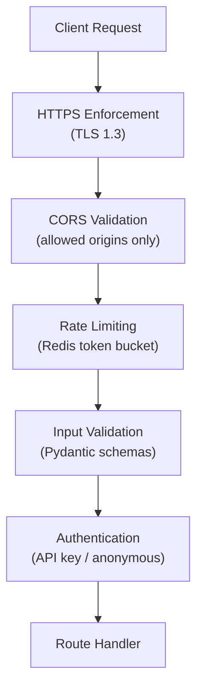

# MemeGPT — API Security

> **Document Version:** 2.0 · **Last Updated:** 2026-08-02

---

## Purpose

Comprehensive API security guide — HTTPS enforcement, CORS policy, API key management, secret storage, and security headers.

---

## Security Layers



---

## HTTPS Enforcement

```python
# Production: HTTP → HTTPS redirect (handled by Vercel/Railway)
# Development: HTTP allowed (localhost only)

@app.middleware("http")
async def enforce_https(request: Request, call_next):
    if settings.is_production and request.url.scheme != "https":
        return RedirectResponse(
            url=str(request.url).replace("http://", "https://"),
            status_code=301
        )
    return await call_next(request)
```

---

## Security Headers

```python
@app.middleware("http")
async def add_security_headers(request: Request, call_next):
    response = await call_next(request)
    response.headers["X-Content-Type-Options"] = "nosniff"
    response.headers["X-Frame-Options"] = "DENY"
    response.headers["X-XSS-Protection"] = "1; mode=block"
    response.headers["Strict-Transport-Security"] = "max-age=31536000; includeSubDomains"
    response.headers["Referrer-Policy"] = "strict-origin-when-cross-origin"
    return response
```

---

## Secret Management

| Secret | Storage | Rotation |
|---|---|---|
| `GROQ_API_KEY` | Railway/Vercel env vars | On compromise |
| `QDRANT_API_KEY` | Railway/Vercel env vars | On compromise |
| `DATABASE_URL` | Railway/Vercel env vars | Never (managed by Supabase) |
| `UPSTASH_REDIS_URL` | Railway/Vercel env vars | On compromise |
| `R2_ACCESS_KEY` | Railway/Vercel env vars | Quarterly |
| API keys (user) | Hashed in PostgreSQL | User-controlled |

### Rules

1. **Never commit secrets to Git** — use `.env` (gitignored) + platform env vars
2. **Never log secrets** — redact in log output
3. **Never expose in responses** — API keys shown as `mgpt_****n4o5p6`
4. **Different keys per environment** — dev ≠ staging ≠ production

---

## CORS Policy

```python
# Strict: Only approved origins
ALLOWED_ORIGINS = [
    "https://memegpt.com",
    "https://app.memegpt.com",
]

if settings.is_development:
    ALLOWED_ORIGINS.extend([
        "http://localhost:3000",
        "http://localhost:5173",
    ])

# NEVER use "*" in production — allows any website to call your API
```

---

## Security Checklist (Pre-Launch)

- [ ] HTTPS enforced (HTTP → HTTPS redirect)
- [ ] CORS restricted to production domains only
- [ ] Rate limiting enabled on all endpoints
- [ ] Input validation on all user input (Pydantic)
- [ ] No raw SQL queries (Prisma ORM only)
- [ ] No secrets in codebase (environment variables only)
- [ ] Debug mode disabled in production
- [ ] Stack traces not exposed to clients
- [ ] Security headers set (HSTS, X-Frame-Options, etc.)
- [ ] `.env` in `.gitignore`
- [ ] API keys hashed before database storage
- [ ] No PII in logs

---

> **Related Documents:**
> - [Security_Overview.md](./Security_Overview.md) — Overall security
> - [Input_Validation.md](./Input_Validation.md) — Input sanitization
> - [Rate_Limiting_Security.md](./Rate_Limiting_Security.md) — DDoS protection
> - [03_Backend/Authentication.md](../03_Backend/Authentication.md) — Auth patterns
