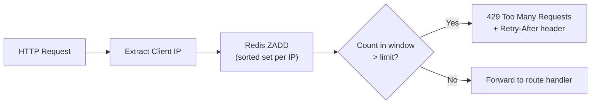

# MemeGPT — Rate Limiting Security

> **Document Version:** 2.0 · **Last Updated:** 2026-08-02

---

## Purpose

Rate limiting as a security measure — DDoS protection, abuse prevention, token bucket implementation, and per-endpoint policies.

---

## Rate Limiting Architecture



---

## Rate Limit Policies

| Endpoint | Limit | Window | Key | Reason |
|---|---|---|---|---|
| `POST /search` | 30/min | Per IP | `rl:search:{ip}` | Most expensive (AI pipeline) |
| `GET /trending` | 60/min | Per IP | `rl:general:{ip}` | Cacheable, lightweight |
| `GET /memes/{slug}` | 60/min | Per IP | `rl:general:{ip}` | Database read only |
| `POST /feedback` | 120/min | Per IP | `rl:feedback:{ip}` | Encourage feedback, lightweight |
| `GET /health` | None | — | — | Monitoring must always work |

---

## Token Bucket Implementation

```python
import time
from redis import Redis

class RateLimiter:
    def __init__(self, redis: Redis):
        self.redis = redis
    
    async def check(self, key: str, limit: int, window: int = 60) -> tuple[bool, int]:
        """
        Token bucket rate limiter using Redis sorted sets.
        Returns (allowed: bool, remaining: int)
        """
        now = time.time()
        pipe = self.redis.pipeline()
        
        pipe.zremrangebyscore(key, 0, now - window)  # Remove expired
        pipe.zadd(key, {str(now): now})               # Add current
        pipe.zcard(key)                                # Count in window
        pipe.expire(key, window)                       # Auto-cleanup
        
        _, _, count, _ = pipe.execute()
        
        allowed = count <= limit
        remaining = max(0, limit - count)
        
        return allowed, remaining
```

---

## DDoS Mitigation Layers

| Layer | Protection | Provider |
|---|---|---|
| 1 | CDN-level rate limiting | Cloudflare (automatic) |
| 2 | Application rate limiting | Redis token bucket |
| 3 | Infrastructure auto-scaling | Railway/Render (paid tier) |
| 4 | IP blocklist | Manual (persistent abusers) |

---

## Best Practices

1. **Rate limit by IP, not by cookie** — cookies can be cleared
2. **Use Redis sorted sets** — O(log n) per operation, atomic
3. **Include rate limit headers** on every response — not just 429s
4. **Different limits per endpoint** — expensive endpoints get stricter limits
5. **Exempt health checks** — monitoring should never be rate limited
6. **Log rate limit violations** — track potential abuse patterns

---

> **Related Documents:**
> - [Security_Overview.md](./Security_Overview.md) — Overall security
> - [Input_Validation.md](./Input_Validation.md) — Input sanitization
> - [07_APIs/Rate_Limiting.md](../07_APIs/Rate_Limiting.md) — API rate limiting docs
