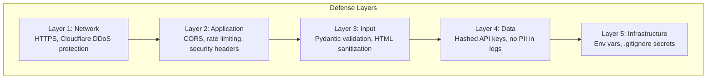

# MemeGPT — Security Overview

> **Document Version:** 2.0 · **Last Updated:** 2026-08-02

---

## Purpose

Complete security architecture — threat model, security layers, OWASP Top 10 mapping, and security audit checklist.

---

## Security Architecture

---

## OWASP Top 10 Mapping

| OWASP Risk | MemeGPT Mitigation | Status |
|---|---|---|
| A01: Broken Access Control | Rate limiting, API key tiers | ✅ Implemented |
| A02: Cryptographic Failures | HTTPS everywhere, hashed keys | ✅ Implemented |
| A03: Injection | Prisma ORM (parameterized), no raw SQL | ✅ Implemented |
| A04: Insecure Design | Threat model, security review | ✅ Documented |
| A05: Security Misconfiguration | Security headers, CORS policy | ✅ Implemented |
| A06: Vulnerable Components | Dependabot, regular updates | ⚠️ Manual |
| A07: Auth Failures | No auth required (MVP), API keys (Phase 2) | ✅ By design |
| A08: Data Integrity | Input validation (Pydantic) | ✅ Implemented |
| A09: Logging Failures | Structured logs, Sentry, no PII | ✅ Implemented |
| A10: SSRF | No URL fetching from user input | ✅ By design |

---

## Threat Model

| Threat | Likelihood | Impact | Mitigation |
|---|---|---|---|
| DDoS attack | Medium | High | Cloudflare + rate limiting |
| API key theft | Low | Medium | Hashed storage, key rotation |
| SQL injection | Very Low | Critical | Prisma ORM (parameterized) |
| XSS attack | Low | Medium | HTML sanitization + React escaping |
| Prompt injection | Medium | Low | JSON-only LLM output parsing |
| Data breach | Low | High | No user accounts (MVP), no PII stored |
| Dependency vulnerability | Medium | Medium | Dependabot alerts |

---

## Security Checklist

- [x] HTTPS enforced in production
- [x] CORS restricted to known origins
- [x] Rate limiting enabled
- [x] Input validation (Pydantic)
- [x] No raw SQL queries
- [x] No PII in logs
- [x] Security headers (HSTS, X-Frame-Options)
- [x] Secrets in environment variables
- [x] `.env` in `.gitignore`
- [x] LLM output parsed as JSON only
- [ ] Dependency scanning (Dependabot) — TODO
- [ ] Security audit — Phase 2

---

> **Related Documents:**
> - [Input_Validation.md](./Input_Validation.md) — Input sanitization
> - [Rate_Limiting_Security.md](./Rate_Limiting_Security.md) — DDoS protection
> - [API_Security.md](./API_Security.md) — API security
> - [Data_Privacy.md](./Data_Privacy.md) — Privacy compliance
