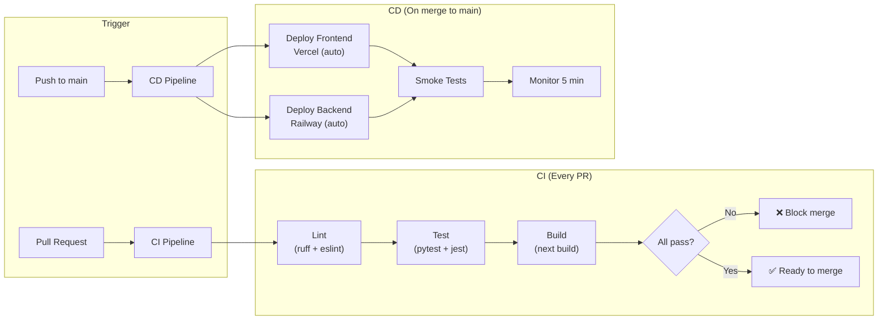

# MemeGPT — CI/CD Pipeline

> **Document Version:** 2.0 · **Last Updated:** 2026-08-02

---

## Purpose

Complete CI/CD specification — GitHub Actions workflows, build/test/deploy automation, environment promotion, and deployment safety checks.

---

## CI/CD Architecture



---

## GitHub Actions Workflows

### CI Workflow (Every PR)

```yaml
# .github/workflows/ci.yml
name: CI
on: [pull_request]

jobs:
  lint-and-test:
    runs-on: ubuntu-latest
    steps:
      - uses: actions/checkout@v4

      # Backend
      - uses: actions/setup-python@v5
        with:
          python-version: '3.11'
      - run: pip install -r services/api/requirements.txt
      - run: pip install ruff pytest pytest-asyncio httpx
      - run: ruff check services/api/  # Lint
      - run: pytest services/api/tests/ -v --tb=short
        env:
          APP_ENV: test
          GROQ_API_KEY: ${{ secrets.GROQ_API_KEY }}
          QDRANT_URL: ${{ secrets.QDRANT_URL }}
          QDRANT_API_KEY: ${{ secrets.QDRANT_API_KEY }}

      # Frontend
      - uses: actions/setup-node@v4
        with:
          node-version: '20'
      - run: cd apps/web && npm ci
      - run: cd apps/web && npm run lint
      - run: cd apps/web && npm run build
```

### CD Workflow (Merge to Main)

```yaml
# .github/workflows/deploy.yml
name: Deploy
on:
  push:
    branches: [main]

jobs:
  deploy-backend:
    runs-on: ubuntu-latest
    steps:
      - uses: actions/checkout@v4
      - run: pip install railway-cli
      - run: railway up --service api --detach
        env:
          RAILWAY_TOKEN: ${{ secrets.RAILWAY_TOKEN }}

  deploy-frontend:
    runs-on: ubuntu-latest
    steps:
      # Vercel auto-deploys from Git — this is a fallback
      - uses: actions/checkout@v4
      - run: npx vercel --prod --token=${{ secrets.VERCEL_TOKEN }}

  smoke-test:
    needs: [deploy-backend, deploy-frontend]
    runs-on: ubuntu-latest
    steps:
      - run: |
          sleep 30  # Wait for deploy to stabilize
          curl -f https://api.memegpt.com/health || exit 1
          curl -f https://memegpt.com || exit 1
```

### Weekly Cron Jobs

```yaml
# .github/workflows/cron.yml
name: Weekly Jobs
on:
  schedule:
    - cron: '0 3 * * 0'  # Sunday 3 AM UTC

jobs:
  recalculate-popularity:
    runs-on: ubuntu-latest
    steps:
      - uses: actions/checkout@v4
      - run: pip install -r services/api/requirements.txt
      - run: python scripts/recalculate_popularity.py

  refresh-trending:
    runs-on: ubuntu-latest
    steps:
      - uses: actions/checkout@v4
      - run: python scripts/refresh_trending.py
```

---

## Pipeline Durations

| Step | Duration | Runs When |
|---|---|---|
| Lint (Python + TS) | ~30s | Every PR |
| Backend tests | ~2 min | Every PR |
| Frontend build | ~1 min | Every PR |
| Backend deploy | ~2 min | Merge to main |
| Frontend deploy | ~1 min | Merge to main |
| Smoke tests | ~1 min | After deploy |
| **Total CI** | **~3.5 min** | |
| **Total CD** | **~4 min** | |

---

## Environment Secrets

| Secret | Used By | Where Set |
|---|---|---|
| `GROQ_API_KEY` | Backend tests | GitHub Secrets |
| `QDRANT_URL` | Backend tests | GitHub Secrets |
| `QDRANT_API_KEY` | Backend tests | GitHub Secrets |
| `RAILWAY_TOKEN` | Backend deploy | GitHub Secrets |
| `VERCEL_TOKEN` | Frontend deploy | GitHub Secrets |
| `DATABASE_URL` | Backend tests | GitHub Secrets |

---

## Best Practices

1. **Block merge if CI fails** — require status checks in branch protection
2. **Run smoke tests after deploy** — catch deployment-specific issues
3. **Use `--detach` for Railway** — don't wait for deployment to complete in CI
4. **Cache pip and npm installs** — reduces CI time by 50%
5. **Separate CI and CD workflows** — CI on every PR, CD only on merge to main

---

> **Related Documents:**
> - [Deployment_Overview.md](./Deployment_Overview.md) — Full deployment guide
> - [Monitoring.md](./Monitoring.md) — Post-deploy monitoring
> - [Rollback_Strategy.md](./Rollback_Strategy.md) — Rollback procedures
