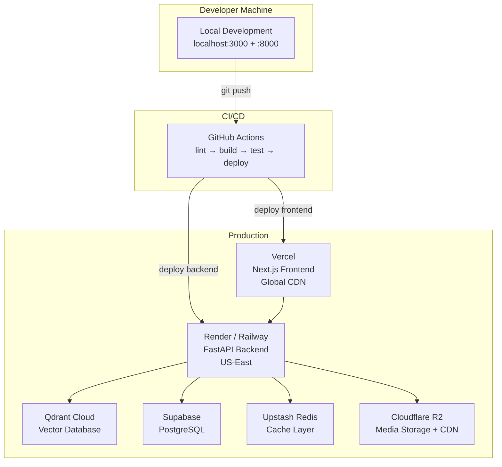

# MemeGPT — Deployment Overview (Complete Guide)

> **Document Version:** 2.0 · **Last Updated:** 2026-08-02

---

## Purpose

Complete deployment guide — from local development to production. Includes Dockerfile, Railway/Render configs, Vercel settings, CI/CD automation, and exact step-by-step commands.

---

## Deployment Architecture



---

## Step-by-Step Deployment

### Week 3, Day 11: Deploy Backend to Railway

```bash
# Install Railway CLI
npm install -g @railway/cli

# Login and init
railway login
railway init

# Set environment variables
railway variables set GROQ_API_KEY=gsk_xxx
railway variables set QDRANT_URL=https://xxx.qdrant.io
railway variables set QDRANT_API_KEY=xxx
railway variables set UPSTASH_REDIS_URL=redis://xxx
railway variables set DATABASE_URL=postgresql://xxx

# Deploy
railway up

# Verify
curl https://api.memegpt.com/health
```

### Week 3, Day 12: Deploy Frontend to Vercel

```bash
# Install Vercel CLI
npm install -g vercel

# Login and deploy
vercel login
cd apps/web
vercel --prod

# Set environment variable
vercel env add API_URL production  # → https://api.memegpt.com

# Custom domain
vercel domains add memegpt.com
```

---

## Dockerfile (Backend)

```dockerfile
FROM python:3.11-slim

WORKDIR /app

# Install system dependencies
RUN apt-get update && \
    apt-get install -y --no-install-recommends \
      tesseract-ocr \
      libglib2.0-0 \
    && rm -rf /var/lib/apt/lists/*

# Install Python dependencies
COPY requirements.txt .
RUN pip install --no-cache-dir -r requirements.txt

# Pre-download ML models during build (not at runtime!)
RUN python -c "from sentence_transformers import SentenceTransformer; SentenceTransformer('all-MiniLM-L6-v2')"
RUN python -c "from transformers import pipeline; pipeline('text-classification', model='j-hartmann/emotion-english-distilroberta-base')"

# Copy application code
COPY . .

# Run
EXPOSE 8000
CMD ["uvicorn", "app.main:app", "--host", "0.0.0.0", "--port", "8000", "--workers", "1"]
```

> **Critical:** Pre-download models during Docker build — not at runtime! This avoids cold-start delays and HuggingFace download failures in production.

---

## Infrastructure Cost Analysis

| Service | Free Tier | Monthly Cost (MVP) | Monthly Cost (10K DAU) |
|---|---|---|---|
| Vercel | 100GB bandwidth | $0 | $0 |
| Render / Railway | 750 hrs / $5 credit | $0 | $7 (Starter) |
| Qdrant Cloud | 1GB, 1M vectors | $0 | $0 |
| Supabase | 500MB DB, 2GB bandwidth | $0 | $25 (Pro) |
| Upstash Redis | 10K commands/day | $0 | $10 |
| Cloudflare R2 | 10GB storage, 10GB egress | $0 | $0 |
| Groq | 6K LLM requests/day | $0 | $0 |
| Expo EAS | 30 builds/month | $0 | $0 |
| GitHub Actions | 2K minutes/month | $0 | $0 |
| Sentry | 5K errors/month | $0 | $0 |
| **Total** | | **$0** | **~$42** |

---

## Environment Configuration

| Environment | Frontend URL | Backend URL | Database |
|---|---|---|---|
| **Development** | `localhost:5173` | `localhost:8000` | SQLite (local) |
| **Staging** | `staging.memegpt.com` | `api-staging.memegpt.com` | Supabase (staging) |
| **Production** | `memegpt.com` | `api.memegpt.com` | Supabase (prod) |

---

## Cold Start Mitigation

Render/Railway free tier sleeps after inactivity. Solution:

```yaml
# UptimeRobot configuration
Monitor Type: HTTP(s)
URL: https://api.memegpt.com/health
Interval: 5 minutes
Alert: Email after 2 failures
```

This sends a ping every 5 minutes, keeping the container warm. Free tier includes 50 monitors.

---

## Rollback Strategy

| Scenario | Action |
|---|---|
| Frontend bug | Vercel: Instant rollback to previous deployment in dashboard |
| Backend bug | Railway: `railway up --service api --detach` to previous commit |
| Database migration failure | Prisma: `npx prisma migrate resolve --rolled-back` |
| ML model regression | Revert Docker image to previous tag |

---

## Health Check Endpoint

```python
@app.get("/health")
async def health():
    return {
        "status": "ok",
        "version": "1.0.0",
        "uptime_seconds": int(time.time() - START_TIME),
        "services": {
            "database": check_db_connection(),
            "qdrant": check_qdrant_connection(),
            "redis": check_redis_connection(),
            "groq": check_groq_availability(),
        },
        "models": {
            "miniLM": "loaded" if app.state.text_model else "not loaded",
            "emotion": "loaded" if app.state.emotion_pipeline else "not loaded",
        }
    }
```

---

## Security Checklist (Pre-Deploy)

- [ ] All API keys in environment variables (not hardcoded)
- [ ] CORS origins restricted to production domains
- [ ] Rate limiting enabled
- [ ] HTTPS enforced (HTTP → HTTPS redirect)
- [ ] Debug mode disabled (`--reload` removed)
- [ ] Single worker in production (`--workers 1` for free tier RAM)
- [ ] Error messages sanitized (no stack traces to client)
- [ ] `.env` file in `.gitignore`

---

> **Related Documents:**
> - [CI_CD_Pipeline.md](./CI_CD_Pipeline.md) — GitHub Actions workflows
> - [Infrastructure.md](./Infrastructure.md) — Service map and cost
> - [Monitoring.md](./Monitoring.md) — Uptime and alerting
> - [01_Getting_Started/Production_Setup.md](../01_Getting_Started/Production_Setup.md) — Setup guide
