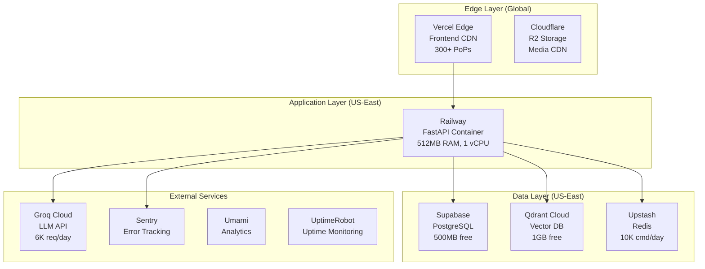

# MemeGPT — Infrastructure

> **Document Version:** 2.0 · **Last Updated:** 2026-08-02

---

## Purpose

Complete infrastructure map — all services, providers, regions, costs, and networking topology.

---

## Infrastructure Diagram

---

## Service Inventory

| Service | Provider | Plan | Region | Cost |
|---|---|---|---|---|
| Frontend hosting | Vercel | Hobby (free) | Global CDN | $0 |
| Backend hosting | Railway | Starter ($5 credit) | US-East | $0–$7 |
| PostgreSQL | Supabase | Free (500MB) | US-East-1 | $0 |
| Vector DB | Qdrant Cloud | Free (1GB) | US-East | $0 |
| Cache | Upstash | Free (10K/day) | US-East | $0 |
| Object storage | Cloudflare R2 | Free (10GB) | Global | $0 |
| LLM inference | Groq Cloud | Free (6K/day) | US | $0 |
| Error tracking | Sentry | Free (5K events) | Global | $0 |
| Analytics | Umami | Self-hosted | — | $0 |
| Uptime monitoring | UptimeRobot | Free (50 monitors) | Global | $0 |
| CI/CD | GitHub Actions | Free (2K min) | — | $0 |
| DNS | Cloudflare | Free | Global | $0 |
| Domain | Namecheap | $8.88/year | — | $9 |
| **Total Monthly** | | | | **$0–$7** |

---

## Networking

| Connection | Protocol | Encryption | Latency |
|---|---|---|---|
| Client → Vercel | HTTPS (TLS 1.3) | ✅ | ~20ms |
| Vercel → Railway | HTTPS | ✅ | ~5ms |
| Railway → Qdrant | gRPC over HTTPS | ✅ | ~10ms |
| Railway → Supabase | PostgreSQL (SSL) | ✅ | ~5ms |
| Railway → Upstash | Redis (TLS) | ✅ | ~3ms |
| Railway → Groq | HTTPS | ✅ | ~50ms |
| Client → R2 | HTTPS | ✅ | ~15ms |

---

## Best Practices

1. **Co-locate everything in US-East** — minimizes inter-service latency
2. **Use free tiers aggressively** — $0 operational cost for MVP
3. **Monitor all services** — UptimeRobot for endpoints, Sentry for errors
4. **Plan upgrades at 80% capacity** — don't wait until limits are hit
5. **No single points of failure** — graceful degradation on any service outage

---

> **Related Documents:**
> - [Deployment_Overview.md](./Deployment_Overview.md) — Deployment guide
> - [Scaling.md](./Scaling.md) — Scaling strategy
> - [Monitoring.md](./Monitoring.md) — Monitoring setup
