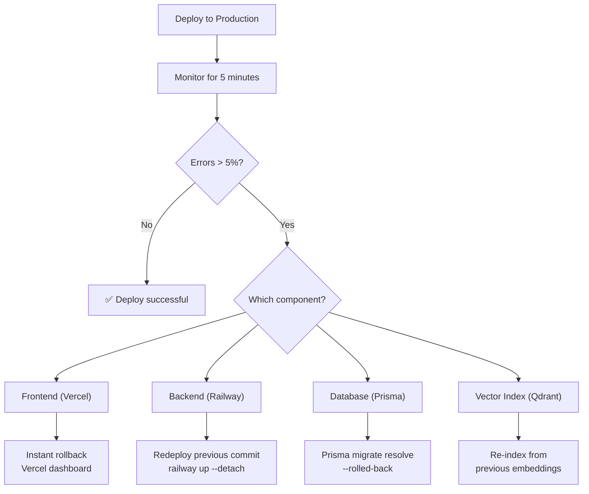
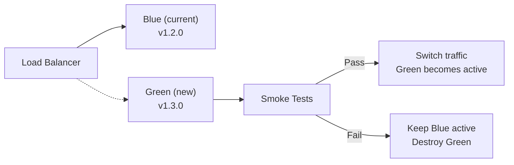

# MemeGPT — Rollback Strategy

> **Document Version:** 2.0 · **Last Updated:** 2026-08-02

---

## Purpose

Step-by-step rollback procedures for every deployment failure scenario — frontend, backend, database, and vector index rollbacks.

---

## Rollback Decision Tree



---

## Rollback Procedures

### Frontend Rollback (Instant)

```bash
# Option 1: Vercel dashboard
# Deployments → Select previous → "Promote to Production"

# Option 2: CLI
vercel rollback
```
**Recovery time:** <30 seconds

### Backend Rollback

```bash
# Option 1: Redeploy previous commit
git revert HEAD
git push origin main
# Auto-deploys via CI/CD

# Option 2: Railway-specific
railway up --service api --detach  # Uses last good image
```
**Recovery time:** 2-5 minutes

### Database Rollback

```bash
# Mark last migration as rolled back
npx prisma migrate resolve --rolled-back <migration_name>

# Restore from backup (nuclear option)
supabase db restore backup_latest.sql
```
**Recovery time:** 5-15 minutes

### Vector Index Rollback

```bash
# Re-index from previous processed data
python scripts/index_qdrant.py --source data/processed/backup/
python scripts/verify_index.py
```
**Recovery time:** 15-30 minutes

---

## Prevention: Blue-Green Deployment (Phase 3)



---

## Best Practices

1. **Monitor for 5 minutes after every deploy** — catch errors early
2. **Keep previous 3 deployments** — Vercel retains all, Railway keeps images
3. **Database backups before migrations** — `supabase db dump` first
4. **Never roll forward** — if it's broken, roll back first, fix second
5. **Document every rollback** — post-mortem for learning

---

> **Related Documents:**
> - [Deployment_Overview.md](./Deployment_Overview.md) — Deployment guide
> - [CI_CD_Pipeline.md](./CI_CD_Pipeline.md) — CI/CD automation
> - [12_Deployment/Monitoring.md](./Monitoring.md) — Error detection
