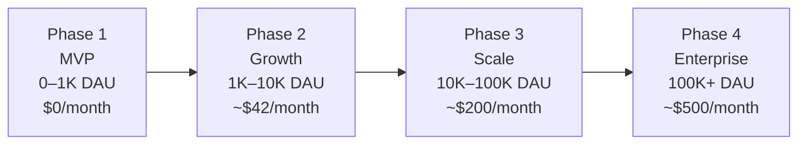

# MemeGPT — Scaling Strategy

> **Document Version:** 2.0 · **Last Updated:** 2026-08-02

---

## Purpose

Horizontal and vertical scaling plan for MemeGPT — from MVP (free tier) to 100K DAU, including cost projections and scaling triggers.

---

## Scaling Phases



---

## Scaling Triggers

| Metric | Current | Trigger | Action |
|---|---|---|---|
| Qdrant vectors | 10K | >500K | Upgrade to paid cluster |
| Redis commands | 5K/day | >10K/day | Upgrade Upstash plan ($10/mo) |
| API response time P95 | 1.2s | >3.0s | Add second API worker |
| Database size | 100MB | >500MB | Upgrade Supabase plan ($25/mo) |
| CDN bandwidth | 5GB/mo | >10GB/mo | Still free (R2 has 10GB free) |
| Concurrent users | 10 | >50 | Scale horizontally |

---

## Cost Projections

| Users (DAU) | Backend | Database | Vector DB | Cache | CDN | **Total** |
|---|---|---|---|---|---|---|
| **100** | $0 | $0 | $0 | $0 | $0 | **$0** |
| **1,000** | $0 | $0 | $0 | $0 | $0 | **$0** |
| **5,000** | $7 | $0 | $0 | $0 | $0 | **$7** |
| **10,000** | $7 | $25 | $0 | $10 | $0 | **$42** |
| **50,000** | $25 | $25 | $25 | $20 | $0 | **$95** |
| **100,000** | $50 | $50 | $50 | $30 | $15 | **$195** |

---

## Horizontal Scaling Strategy

### Backend (FastAPI)

```python
# Single worker → Multiple workers
# Development:
uvicorn app.main:app --workers 1  # Free tier: 512MB RAM

# Scaled:
uvicorn app.main:app --workers 4  # 4 workers, ~2GB RAM
# Or use Gunicorn:
gunicorn app.main:app -w 4 -k uvicorn.workers.UvicornWorker
```

**Constraint:** Each worker loads MiniLM (80MB) + Emotion model (250MB) = ~330MB per worker.

### Database

| Phase | Strategy |
|---|---|
| MVP | Single Supabase instance (read + write) |
| Growth | Connection pooling via PgBouncer (Supabase built-in) |
| Scale | Read replicas for search_logs/feedback queries |

### Vector Database

| Phase | Strategy |
|---|---|
| MVP | Qdrant Cloud free (1GB, 1M vectors) |
| Growth | Same (10K memes = ~50MB, well within free tier) |
| Scale | Qdrant paid cluster with sharding |

### Cache

| Phase | Strategy |
|---|---|
| MVP | Upstash Redis free (10K commands/day) |
| Growth | Upstash paid ($10/mo, 10M commands/day) |
| Scale | Dedicated Redis instance |

---

## Best Practices

1. **Optimize before scaling** — caching, query optimization, lazy loading
2. **Scale vertically first** — cheaper and simpler than horizontal
3. **Monitor before acting** — scale based on data, not assumptions
4. **Cache aggressively** — >60% cache hit rate reduces infrastructure needs dramatically
5. **Free tier is your friend** — MemeGPT runs at $0 for up to ~5K DAU

---

> **Related Documents:**
> - [Infrastructure.md](./Infrastructure.md) — Service map
> - [Deployment_Overview.md](./Deployment_Overview.md) — Deployment guide
> - [03_Backend/Performance.md](../03_Backend/Performance.md) — Performance optimization
