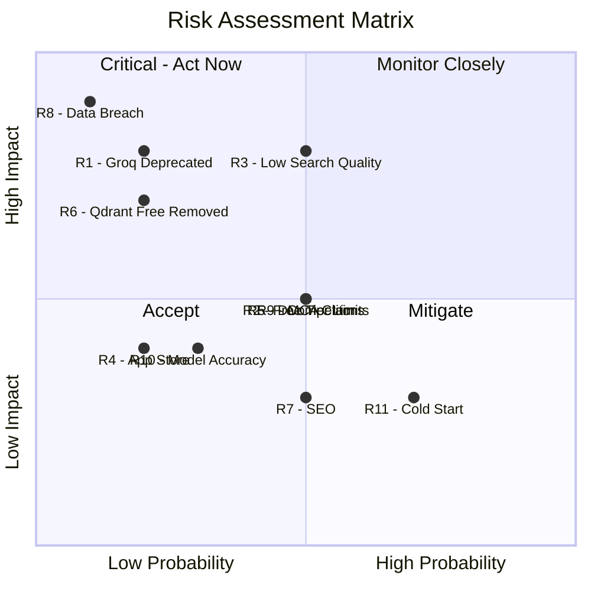

# MemeGPT — Risk Register

> **Document Version:** 1.0 · **Last Updated:** 2026-08-02

---

## Active Risks

| ID | Risk | Probability | Impact | Score | Status | Mitigation |
|---|---|---|---|---|---|---|
| R1 | **Groq API becomes paid/deprecated** | Low | High | 🟡 Medium | Open | Maintain Ollama fallback, evaluate Gemini API |
| R2 | **Free tier limits exceeded** | Medium | Medium | 🟡 Medium | Open | Usage dashboard, graceful degradation, upgrade path |
| R3 | **Low search quality at launch** | Medium | High | 🔴 High | Mitigating | Manual curation of 1K memes, test dataset, weekly evals |
| R4 | **App store rejection** | Low | Medium | 🟢 Low | Open | Follow guidelines, no NSFW default, proper permissions |
| R5 | **Copyright/DMCA complaints** | Medium | Medium | 🟡 Medium | Open | DMCA process, attribution, 48-hr takedown SLA |
| R6 | **Qdrant Cloud free tier removed** | Low | High | 🟡 Medium | Open | Docker self-hosted backup, export snapshots |
| R7 | **Poor SEO performance** | Medium | Low | 🟢 Low | Open | 10K+ pages, long-tail targeting, Schema.org |
| R8 | **User data breach** | Very Low | Very High | 🟡 Medium | Mitigated | No PII stored, anonymous by default, HTTPS only |
| R9 | **Competitor launches similar product** | Medium | Medium | 🟡 Medium | Open | Superior AI quality, free tier, speed, developer API |
| R10 | **ML model accuracy degrades over time** | Low | Medium | 🟢 Low | Open | Weekly offline eval, A/B testing, feedback loop |
| R11 | **Render free tier cold start latency** | High | Low | 🟡 Medium | Mitigated | UptimeRobot pings every 5 min |
| R12 | **HuggingFace model downloads blocked** | Low | High | 🟡 Medium | Open | Pre-download in Docker build, cache in CI |

---

## Risk Matrix

---

> **Related Documents:**
> - [Roadmap.md](./Roadmap.md) · [MVP_Phases.md](./MVP_Phases.md)
