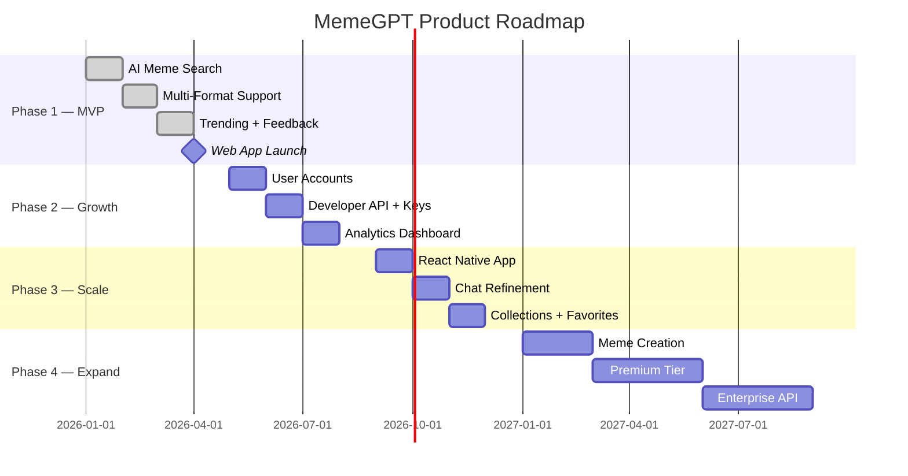

# MemeGPT — Roadmap

> **Document Version:** 2.0 · **Last Updated:** 2026-08-02

---

## Purpose

Complete product roadmap — four phases from MVP to enterprise, with feature details, timeline, and success metrics per phase.

---

## Phase Overview

---

## Phase 1: MVP (Months 1–4) ✅

| Feature | Status | Details |
|---|---|---|
| AI-powered meme search | ✅ | Groq + MiniLM + Qdrant pipeline |
| Emotion detection | ✅ | DistilRoBERTa, 7 emotions |
| Multi-format support | ✅ | GIF, PNG, MP4, WebP |
| Copy to clipboard | ✅ | Clipboard API |
| Download | ✅ | CDN redirect |
| Suggestion chips | ✅ | Quick search tags |
| Trending memes | ✅ | Hourly refresh, 6 categories |
| Feedback (👍/👎) | ✅ | Weight-based scoring |
| SEO meme pages | ✅ | SSR with Next.js 14 |
| Responsive web app | ✅ | Desktop + mobile |

**Success Metrics:** 1K DAU, 75% positive feedback, P95 <3s

---

## Phase 2: Growth (Months 5–8)

| Feature | Priority | Details |
|---|---|---|
| User accounts (OAuth) | P0 | Google/GitHub login via NextAuth |
| Developer API keys | P0 | API key registration, tier management |
| Saved favorites | P1 | Save memes to personal library |
| Search history | P1 | View last 50 searches |
| Analytics dashboard | P1 | Usage charts, popular queries |
| Content moderation | P1 | NSFW detection, user reports |
| Webhooks | P2 | Notify on trending changes |

**Success Metrics:** 5K DAU, 100 API keys issued, <2% error rate

---

## Phase 3: Scale (Months 9–12)

| Feature | Priority | Details |
|---|---|---|
| React Native mobile app | P0 | iOS + Android via Expo |
| Chat refinement | P1 | "Something more sarcastic" follow-ups |
| Collections | P1 | Create/share meme collections |
| Image-based search | P2 | Upload image → find similar memes |
| Personalization | P2 | Rank based on user's past likes |
| Multi-language UI | P2 | Spanish, Hindi, Portuguese |

**Success Metrics:** 10K DAU, 1K mobile downloads, P95 <2s

---

## Phase 4: Expand (Year 2)

| Feature | Priority | Details |
|---|---|---|
| Meme creation tool | P1 | Text overlay, template library |
| Premium tier ($9/mo) | P0 | Unlimited searches, priority API |
| Enterprise API | P1 | SLA, dedicated support, bulk pricing |
| Real-time meme tracking | P2 | Live trending from Twitter/Reddit |
| AI meme generation | P2 | Generate new memes from prompts |

**Success Metrics:** 50K DAU, $1K MRR, 99.9% uptime

---

> **Related Documents:**
> - [MVP_Phases.md](./MVP_Phases.md) — Phase breakdown
> - [Risk_Register.md](./Risk_Register.md) — Risk management
> - [00_Project_Overview/Product_Scope.md](../00_Project_Overview/Product_Scope.md) — Scope
