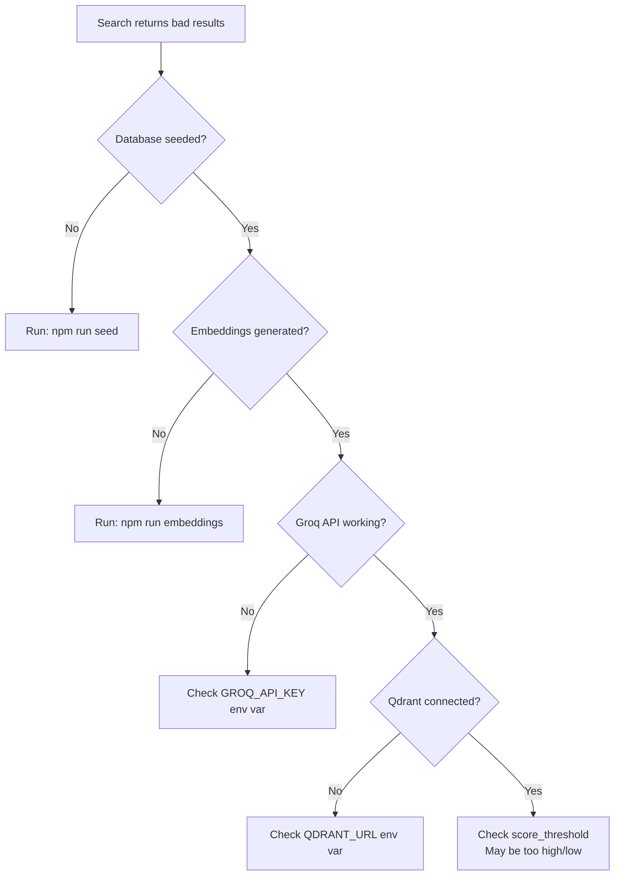

# MemeGPT — Debug Guide

> **Document Version:** 1.0 · **Last Updated:** 2026-08-02

---

## Purpose

Comprehensive debugging guide for every component of MemeGPT.

---

## Backend Debugging

### Run with Debug Logging

```bash
LOG_LEVEL=DEBUG python -m uvicorn app.main:app --reload --port 8000
```

### Test a Specific Endpoint

```bash
# Health check
curl -s http://localhost:8000/health | python -m json.tool

# Search
curl -s -X POST http://localhost:8000/search \
  -H "Content-Type: application/json" \
  -d '{"query": "Monday morning", "limit": 3}' | python -m json.tool

# Single meme
curl -s http://localhost:8000/memes/THIS_IS_FINE_ID | python -m json.tool
```

### Debug Search Quality

```python
# Debug script to see scoring breakdown
from app.meme_matcher import match_memes

results = match_memes("Monday morning", limit=5)
for r in results:
    print(f"{r['name']}: keyword={r.get('keyword_score',0):.2f} "
          f"semantic={r.get('semantic_score',0):.2f} "
          f"emotion={r.get('emotion_score',0):.2f} "
          f"composite={r.get('composite_score',0):.2f}")
```

### Debug Embedding Generation

```python
from app.semantic_search import embed_text
import numpy as np

vec = embed_text("test query")
print(f"Shape: {len(vec)}")
print(f"Norm: {np.linalg.norm(vec):.4f}")  # Should be ~1.0
print(f"Min: {min(vec):.4f}, Max: {max(vec):.4f}")
```

---

## Frontend Debugging

### Chrome DevTools

1. **Console** (F12 → Console): Check for JavaScript errors
2. **Network** (F12 → Network): Verify API requests/responses
3. **Performance** (F12 → Performance): Record and analyze slow renders
4. **React DevTools** (extension): Inspect component state and props
5. **Application → Local Storage**: Check saved preferences and favorites

### Common Frontend Debug Commands

```javascript
// Check API connectivity
fetch('http://localhost:8000/health').then(r => r.json()).then(console.log);

// Check localStorage
JSON.parse(localStorage.getItem('favorites'));

// Clear all cached data
localStorage.clear();
```

---

## Database Debugging

```bash
# Open Prisma Studio (visual database browser)
npx prisma studio

# Check database contents
sqlite3 prisma/dev.db "SELECT COUNT(*) FROM Meme;"
sqlite3 prisma/dev.db "SELECT name, viralScore FROM Meme ORDER BY viralScore DESC LIMIT 10;"

# Check if database is seeded
sqlite3 prisma/dev.db "SELECT COUNT(*) as total FROM Meme;"
# Should be 1000+
```

---

## ML Model Debugging

```python
# Test emotion detection
from transformers import pipeline
classifier = pipeline("text-classification",
    model="j-hartmann/emotion-english-distilroberta-base",
    return_all_scores=True)
results = classifier("I'm so frustrated with this bug!")
for r in sorted(results[0], key=lambda x: -x['score'])[:3]:
    print(f"{r['label']}: {r['score']:.2%}")

# Test Groq intent parsing
import groq
client = groq.Groq(api_key="your_key")
response = client.chat.completions.create(
    model="llama-3.1-8b-instant",
    messages=[{"role": "user", "content": "Parse: Monday morning"}],
    temperature=0.1, max_tokens=200
)
print(response.choices[0].message.content)
```

---

## Network Debugging

| Issue | Tool | Command |
|---|---|---|
| DNS resolution | nslookup | `nslookup api.memegpt.com` |
| Port availability | netstat | `netstat -ano \| findstr :8000` |
| SSL certificate | openssl | `openssl s_client -connect api.memegpt.com:443` |
| API response time | curl | `curl -w "@curl-format.txt" -o /dev/null -s api.memegpt.com/health` |

---

## Decision Tree: "Search Returns Bad Results"



---

> **Related Documents:**
> - [Common_Issues.md](./Common_Issues.md) · [01_Getting_Started/Development_Setup.md](../01_Getting_Started/Development_Setup.md)
