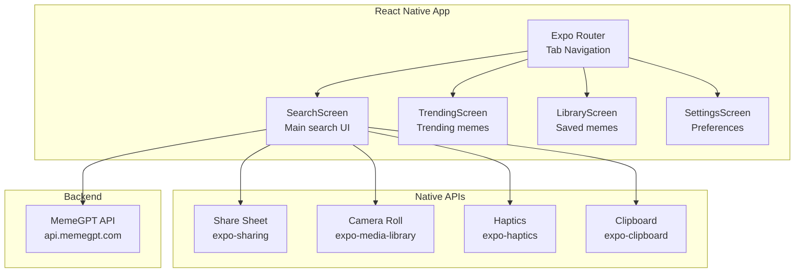

# MemeGPT — Mobile App Overview

> **Document Version:** 1.0 · **Last Updated:** 2026-08-01

---

## Tech Stack

| Technology | Version | Purpose |
|---|---|---|
| React Native | 0.74 | Cross-platform UI framework |
| Expo | SDK 51 | Build toolchain + native APIs |
| Expo Router | 3.x | File-based routing |
| EAS Build | — | Cloud builds for iOS/Android |
| Hermes | — | JavaScript engine (fast startup) |

---

## Architecture



---

## Platform Differences

| Feature | iOS | Android |
|---|---|---|
| Share sheet | Native UIActivityViewController | Native Intent.ACTION_SEND |
| Save to camera roll | Photos permission | Storage permission |
| Haptic feedback | Taptic Engine | Vibration API |
| Push notifications | APNs | FCM |
| App size | ~35MB (Hermes) | ~29MB (Hermes) |
| Min OS | iOS 15+ | Android 10+ (API 29) |

---

## Build & Release

### Development
```bash
# Start Expo dev server
npx expo start

# Run on iOS Simulator
npx expo run:ios

# Run on Android Emulator
npx expo run:android
```

### Production Build (EAS)
```bash
# iOS build
eas build --platform ios --profile production

# Android build
eas build --platform android --profile production

# Submit to stores
eas submit --platform ios
eas submit --platform android
```

---

## App Size Budget

| Component | Size |
|---|---|
| Hermes runtime | 15MB |
| JS bundle (minified) | 4MB |
| Expo modules | 8MB |
| App assets | 2MB |
| **Total** | **~29MB** ✅ |

---

## Mobile-Specific Features

| Feature | Implementation | Priority |
|---|---|---|
| Native share sheet | `expo-sharing` | P0 |
| Save to camera roll | `expo-media-library` | P0 |
| Haptic feedback on copy | `expo-haptics` | P1 |
| Offline cache (last 50 memes) | AsyncStorage + MMKV | P1 |
| Double-tap to favorite | GestureHandler | P1 |
| Pull-to-refresh | FlatList onRefresh | P1 |
| Voice input | `expo-speech` | P2 |

---

> **Related Documents:**
> - [04_Frontend/Frontend_Overview.md](../04_Frontend/Frontend_Overview.md) · [12_Deployment/Deployment_Overview.md](../12_Deployment/Deployment_Overview.md)
