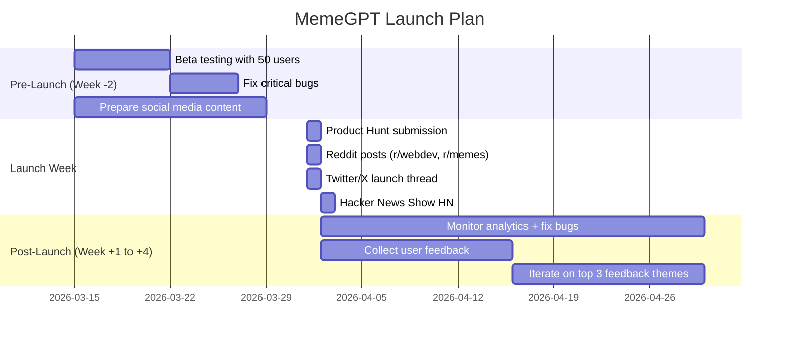

# MemeGPT — Launch Strategy

> **Document Version:** 2.0 · **Last Updated:** 2026-08-02

---

## Purpose

Complete launch plan — pre-launch, launch day, and post-launch activities for MemeGPT's web and mobile apps.

---

## Launch Timeline



---

## Launch Channels

| Channel | Action | Expected Impact |
|---|---|---|
| **Product Hunt** | Submit as "MemeGPT — AI Meme Finder" | 500–2K first-day visitors |
| **Reddit** | Post on r/webdev, r/memes, r/SideProject | 200–1K visitors |
| **Twitter/X** | Launch thread with demo GIF | 100–500 visitors |
| **Hacker News** | "Show HN: I built an AI meme finder" | 500–5K visitors (if trending) |
| **Dev.to** | Technical blog post about the AI pipeline | 200–500 developers |
| **LinkedIn** | "I built this" post with demo | 100–300 professionals |
| **Instagram Reels** | 30-second demo video | 500–2K Gen-Z users |

---

## Pre-Launch Checklist

### Technical

- [ ] All critical bugs fixed
- [ ] Performance tested (P95 <3s)
- [ ] Rate limiting enabled
- [ ] Error monitoring (Sentry) configured
- [ ] Analytics (Umami) installed
- [ ] SSL certificates valid
- [ ] Custom domain configured
- [ ] Health check endpoint verified

### Content

- [ ] Landing page live with clear CTA
- [ ] App Store listings published (iOS + Android)
- [ ] Social media accounts created (@memegpt)
- [ ] Demo GIF/video recorded (30 seconds)
- [ ] Product Hunt ship page ready
- [ ] Press kit (logo, screenshots, one-liner)

### SEO

- [ ] Sitemap submitted to Google Search Console
- [ ] OG images set for social sharing
- [ ] Meta descriptions on all pages
- [ ] 10,000+ meme pages indexed

---

## Launch Day Script

```
08:00 AM — Publish Product Hunt listing
08:15 AM — Post Twitter launch thread
08:30 AM — Post on Reddit (r/SideProject first)
09:00 AM — Post on LinkedIn
09:30 AM — Post on Dev.to
10:00 AM — Monitor analytics dashboard
12:00 PM — Reply to all Product Hunt comments
02:00 PM — Post on Hacker News (Show HN)
06:00 PM — Share first-day metrics on Twitter
10:00 PM — Review error logs, fix critical issues
```

---

## Success Metrics (Launch Week)

| Metric | Target | How to Track |
|---|---|---|
| Unique visitors | 1,000 | Umami Analytics |
| Searches performed | 5,000 | Backend logs |
| Downloads/copies | 500 | Feedback API |
| App Store downloads | 100 | App Store Connect / Google Play Console |
| Product Hunt upvotes | 100 | Product Hunt |
| Error rate | <2% | Sentry |
| P95 response time | <3s | Backend metrics |

---

## Post-Launch Priorities

1. **Fix top 3 user-reported bugs** (Week 1)
2. **Implement top 3 feature requests** (Week 2–3)
3. **Write first SEO blog post** — "Best Monday Memes 2026" (Week 2)
4. **Submit to app review sites** — AppAdvice, AppSumo (Week 3)
5. **Start weekly meme re-indexing** — add new trending memes (Week 4)

---

> **Related Documents:**
> - [Marketing_Plan.md](./Marketing_Plan.md) — Long-term marketing
> - [SEO_Strategy.md](./SEO_Strategy.md) — SEO implementation
> - [App_Store_Optimization.md](./App_Store_Optimization.md) — ASO strategy
