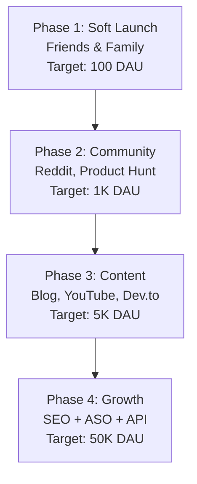

# MemeGPT — Marketing Plan

> **Document Version:** 1.0 · **Last Updated:** 2026-08-02

---

## Launch Funnel

---

## Channel Strategy

| Channel | Strategy | Expected % of Traffic | Cost |
|---|---|---|---|
| **SEO** | 10K+ indexed meme pages | 50% | $0 |
| **App Store (ASO)** | Optimized listing, screenshots, keywords | 25% | $0 |
| **Word of mouth** | Share buttons, referral mechanics | 15% | $0 |
| **Content marketing** | Blog, tutorials, social media | 5% | $0 |
| **Developer API** | Free tier attracts builders | 5% | $0 |

---

## Reddit Launch Strategy

### Target Subreddits

| Subreddit | Members | Post Strategy |
|---|---|---|
| r/SideProject | 250K | "I built an AI meme search engine" |
| r/InternetIsBeautiful | 17M | "MemeGPT — describe a feeling, get a meme" |
| r/webdev | 2M | Technical deep-dive post |
| r/ProgrammerHumor | 3M | Demo with programming memes |
| r/artificial | 600K | AI/ML architecture post |

### Product Hunt Launch

- Prepare: tagline, description, 4 screenshots, demo video
- Launch on Tuesday (highest traffic)
- Reply to every comment within 1 hour
- Target: Top 5 of the day

---

## Content Calendar (Month 1)

| Week | Content | Platform |
|---|---|---|
| Week 1 | "I built an AI meme search engine" | Reddit |
| Week 2 | Product Hunt launch | PH |
| Week 2 | Demo video (60s) | Twitter/X |
| Week 3 | "How I Built MemeGPT" technical article | Dev.to |
| Week 4 | "Top 10 Work Memes" listicle | Blog |
| Week 4 | "MemeGPT Architecture" thread | Twitter/X |

---

> **Related Documents:**
> - [SEO_Strategy.md](../16_SEO_Marketing/SEO_Strategy.md) · [00_Project_Overview/Goals.md](../00_Project_Overview/Goals.md)
